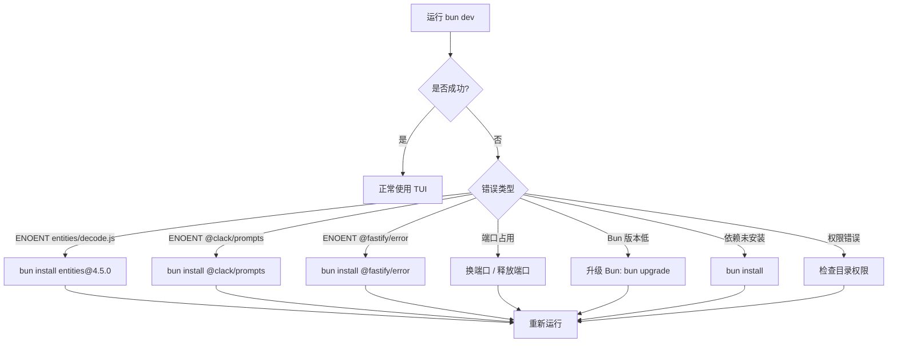

# OpenCode 项目启动操作手册

> 适用仓库：[anomalyco/opencode](https://github.com/anomalyco/opencode)
> 最后更新：2026-07-23

---

## 目录

1. [环境要求](#1-环境要求)
2. [首次启动（快速开始）](#2-首次启动快速开始)
3. [启动模式详解](#3-启动模式详解)
   - [TUI 模式](#31-tui-模式默认)
   - [API Server 模式](#32-api-server-模式)
   - [Web 模式](#33-web-模式)
   - [Desktop 模式](#34-desktop-模式)
   - [Console 模式](#35-console-模式)
   - [Mini 模式](#36-mini-模式快速调试)
4. [常用参数](#4-常用参数)
5. [环境变量](#5-环境变量)
6. [查看日志](#6-查看日志)
7. [项目架构全貌](#7-项目架构全貌)
   - [技术栈](#71-技术栈)
   - [分层包架构](#72-分层包架构)
   - [核心目录详解](#73-packagesopencode-src-核心目录)
   - [核心抽象：Effect 框架](#74-核心抽象effect-框架)
   - [数据流全景](#75-数据流全景)
   - [核心入口文件速查](#76-核心入口文件速查)
   - [根目录关键文件](#77-根目录关键文件)
8. [TUI 架构详解](#8-tui-架构详解)
   - [架构概览](#81-架构概览)
   - [核心文件详解](#82-核心文件详解)
   - [完整启动流程](#83-完整启动流程)
   - [用户操作流程](#84-用户操作流程)
   - [SIGUSR2 配置重载](#85-sigus2-配置重载)
   - [堆快照分析](#86-堆快照分析)
9. [常见问题排查](#9-常见问题排查)
10. [本地调试](#10-本地调试)
   - [终端 + VS Code Attach](#101-方式一终端启动--vs-code-attach推荐)
   - [VS Code Launch 直接启动](#102-方式二vs-code-launch-直接启动)
   - [分开调试 Server 和 TUI](#103-方式三分开调试-server-和-tui)
   - [TUI 内置调试工具](#104-tui-内置调试工具)
   - [常用断点位置](#105-常用断点位置)
11. [附录：命令速查表](#11-附录命令速查表)

---

## 1. 环境要求

| 依赖 | 版本要求 | 检查命令 |
|------|----------|----------|
| **Bun** | `>= 1.3.0` | `bun --version` |
| **Node.js**（可选） | `>= 18` | `node --version` |
| **Git** | 任意 | `git --version` |

> 当前环境：Bun **1.3.14** ✅

---

## 2. 首次启动（快速开始）

```bash
# 1. 进入项目根目录
cd opencode

# 2. 安装依赖（约 2 分钟，安装 ~930 个包）
bun install

# 3. 启动开发服务器（TUI 模式，推荐新开一个终端窗口执行）
bun dev
```

### 完整流程图

```mermaid
flowchart TD
    A[克隆仓库] --> B[bun install]
    B --> C{"选择启动模式"}
    C --> D[TUI 模式]
    C --> E[API Server]
    C --> F[Web 模式]
    C --> G[Desktop 模式]

    D --> D1[bun dev]
    D1 --> D2[启动 TUI 终端界面]
    D2 --> D3[按 Tab 切换 Agent]
    D2 --> D4[/ 打开命令面板]

    E --> E1[bun dev serve]
    E1 --> E2[服务运行在 http://127.0.0.1:4096]

    F --> F1[bun dev web]
    F --> F2[bun run --cwd packages/app dev]
    F2 --> F3[启动前端开发服务器 localhost:5173]

    G --> G1[bun dev:desktop]
    G1 --> G2[Electron 应用窗口]
```

---

## 3. 启动模式详解

### 3.1 TUI 模式（默认）

终端界面（Terminal UI），最常用的开发模式。

```bash
# 基本启动
bun dev

# 在指定目录运行
bun dev /path/to/project

# 在 opencode 仓库自身目录运行
bun dev .

# 继续上一个会话
bun dev -c

# 指定模型
bun dev -m openai/gpt-4o-mini
```

**适用场景**：日常开发、调试 Agent 行为、代码生成

**注意**：TUI 模式需要终端 TTY 支持，在 CI/后台环境不可用。

---

### 3.2 API Server 模式

启动无头 API 服务器，适合后端集成或从外部工具调用。

```bash
# 默认端口 4096
bun dev serve

# 自定义端口
bun dev serve --port 8080

# 指定主机名
bun dev serve --hostname 0.0.0.0
```

**输出示例**：
```
Warning: OPENCODE_SERVER_PASSWORD is not set; server is unsecured.
opencode server listening on http://127.0.0.1:4096
```

> ⚠️ **安全提醒**：生产环境务必设置 `OPENCODE_SERVER_PASSWORD` 环境变量。

**适用场景**：
- 后端集成 / CI 管道
- 远程开发
- 与其他工具配合使用

#### 代码调用链

```
bun dev serve
  └─ package.json "scripts.dev"
       └─ packages/opencode/src/index.ts    ← yargs CLI 入口，注册 ServeCommand
            └─ packages/opencode/src/cli/cmd/serve.ts  ← command: "serve"
                 └─ packages/opencode/src/server/server.ts  ← Server.listen()
                      └─ HttpRouter.serve(HttpApiApp.createRoutes(opts))
                           └─ Hono HTTP 服务监听端口
```

| # | 文件 | 职责 |
|---|------|------|
| 1 | [package.json](../../package.json) | `bun dev` → `bun run --cwd packages/opencode --conditions=browser src/index.ts`，`serve` 参数传给 CLI |
| 2 | [packages/opencode/src/index.ts](packages/opencode/src/index.ts) | yargs 解析 `serve` 子命令，路由到 ServeCommand |
| 3 | [packages/opencode/src/cli/cmd/serve.ts](packages/opencode/src/cli/cmd/serve.ts) | ServeCommand handler：检查密码 → 解析网络选项 → 调用 `Server.listen()` → `yield* Effect.never` 保持进程 |
| 4 | [packages/opencode/src/server/server.ts](packages/opencode/src/server/server.ts) | `listen()` → `listenEffect()` → `listenerLayer()` → 创建 Hono 路由并监听端口 |

**serve.ts 核心代码**：

```ts
// packages/opencode/src/cli/cmd/serve.ts
handler: Effect.fn("Cli.serve")(function* (args) {
  const { Server } = yield* Effect.promise(() => import("../../server/server"))
  if (!Flag.OPENCODE_SERVER_PASSWORD) {
    console.log("Warning: OPENCODE_SERVER_PASSWORD is not set; server is unsecured.")
  }
  const opts = yield* resolveNetworkOptions(args)
  const server = yield* Effect.promise(() => Server.listen(opts))
  console.log(`opencode server listening on http://${server.hostname}:${server.port}`)
  yield* Effect.never  // 保持进程不退出
})
```

---

### 3.3 Web 模式

启动 Web UI 界面，在浏览器中使用 OpenCode。

需要**同时启动两个进程**：

```bash
# 终端 1：启动 API 服务器
bun dev serve

# 终端 2：启动 Web 前端
bun dev:web
# 等价于：bun run --cwd packages/app dev
```

Web 前端默认运行在 `http://localhost:5173`。

**适用场景**：UI 组件开发、不习惯 TUI 时使用浏览器操作

---

### 3.4 Desktop 模式

启动 Electron 桌面应用。

```bash
bun dev:desktop
```

生产构建：

```bash
bun run --cwd packages/desktop build
bun run --cwd packages/desktop package
```

**适用场景**：桌面端集成测试、原生功能开发

---

### 3.5 Console 模式

启动 Web Console 管理面板。

```bash
bun dev:console
```

**适用场景**：管理后台开发、数据统计

---

### 3.6 Mini 模式（快速调试）

精简版 TUI，启动速度更快，适合快速测试。

```bash
# 启动 mini 模式
bun dev --mini

# 直接指定 prompt，执行后自动退出
bun dev --mini --prompt "生成一个冒泡排序算法"
```

**适用场景**：快速验证流程、单次 Prompt 测试、断点调试

---

## 4. 常用参数

### 全部模式通用

| 参数 | 别名 | 类型 | 说明 | 示例 |
|------|------|------|------|------|
| `--model` | `-m` | string | 指定模型 | `-m openai/gpt-4o` |
| `--continue` | `-c` | boolean | 继续上一个会话 | `-c` |
| `--session` | `-s` | string | 指定会话 ID | `-s ses_xxx` |
| `--fork` | - | boolean | Fork 会话（需配合 -c 或 -s） | `-c --fork` |
| `--prompt` | - | string | 初始 Prompt | `--prompt "你好"` |
| `--agent` | - | string | 指定 Agent | `--agent plan` |
| `--auto` | - | boolean | 自动批准权限 | `--auto` |
| `--mini` | - | boolean | 精简模式 | `--mini` |
| `--print-logs` | - | boolean | 打印日志到 stderr | `--print-logs` |
| `--log-level` | - | string | 日志级别：DEBUG/INFO/WARN/ERROR | `--log-level DEBUG` |

### Server 模式专用

| 参数 | 类型 | 说明 | 默认值 |
|------|------|------|--------|
| `--port` | number | 监听端口 | `4096` |
| `--hostname` | string | 监听地址 | `127.0.0.1` |
| `--mdns` | boolean | 启用 mDNS | `false` |

---

## 5. 环境变量

| 变量名 | 说明 | 示例 |
|--------|------|------|
| `OPENCODE_SERVER_PASSWORD` | API 服务器密码（生产必设） | `export OPENCODE_SERVER_PASSWORD=mypass` |
| `OPENCODE_PRINT_LOGS` | 打印日志到 stderr（等效 --print-logs） | `1` |
| `OPENCODE_LOG_LEVEL` | 日志级别：DEBUG / INFO / WARN / ERROR | `DEBUG` |
| `OPENCODE_ROUTE` | 指定初始路由 | `{"type":"home"}` |
| `OPENCODE_FAST_BOOT` | 跳过启动动画 | `1` |
| `OPENCODE_DISABLE_MOUSE` | 禁用鼠标支持 | `1` |
| `OPENCODE_SHOW_TTFD` | 显示首屏渲染时间 | `1` |
| `OPENCODE_EXPERIMENTAL_DISABLE_COPY_ON_SELECT` | 禁用选择时自动复制 | `1` |
| `BUN_OPTIONS` | Bun 全局选项，如 `--inspect` | `--inspect=ws://localhost:6499/` |

**组合使用示例**：
```bash
OPENCODE_FAST_BOOT=1 \
OPENCODE_ROUTE='{"type":"home"}' \
OPENCODE_DISABLE_MOUSE=1 \
bun dev --mini
```

---

## 6. 查看日志

### 6.1 三种查看方式

#### 方式一：启动时加 `--print-logs` 参数（推荐）

```bash
# 默认 INFO 级别，打印到终端
bun dev --print-logs
bun dev serve --print-logs

# 设置 DEBUG 级别，打印更详细的日志
bun dev serve --print-logs --log-level DEBUG
```

输出示例：
```
timestamp=2026-07-09T04:34:29.685Z level=INFO run=fe475853 message=loading path="...config.json"
timestamp=2026-07-09T04:34:29.690Z level=INFO run=fe475853 message=loading path="...opencode.json"
opencode server listening on http://127.0.0.1:54998
```

每个日志条目包含：`timestamp` 时间戳、`level` 级别、`run` 运行 ID、`message` 消息内容。

#### 方式二：使用环境变量（持久生效）

```bash
# 设置后，后续所有 bun dev 都自动打印日志
export OPENCODE_PRINT_LOGS=1
export OPENCODE_LOG_LEVEL=DEBUG
bun dev serve
```

#### 方式三：查看日志文件

无论是否加 `--print-logs`，日志始终会写入文件。

**Windows 路径**：
```
%LOCALAPPDATA%\opencode\log\opencode.log
# 即：C:\Users\Administrator\AppData\Local\opencode\log\opencode.log
```

**Linux / macOS 路径**：
```
~/.local/share/opencode/log/opencode.log
```

```bash
# 实时跟踪最新日志
tail -f C:/Users/Administrator/AppData/Local/opencode/log/opencode.log

# 查看最后 100 行
tail -n 100 C:/Users/Administrator/AppData/Local/opencode/log/opencode.log

# 搜索关键词
grep ERROR C:/Users/Administrator/AppData/Local/opencode/log/opencode.log
```

### 6.2 日志级别说明

| 级别 | 启动参数 | 环境变量 | 用途 |
|------|----------|----------|------|
| `ERROR` | `--log-level ERROR` | `OPENCODE_LOG_LEVEL=ERROR` | 仅错误 |
| `WARN` | `--log-level WARN` | `OPENCODE_LOG_LEVEL=WARN` | 警告 + 错误 |
| `INFO` | （默认） | （默认） | 常规信息 |
| `DEBUG` | `--log-level DEBUG` | `OPENCODE_LOG_LEVEL=DEBUG` | 详细调试信息 |

> **默认不打印日志**：`bun dev serve` 默认只显示启动信息，不加 `--print-logs` 不会输出应用日志。

---

## 7. 项目架构全貌

### 7.1 技术栈

| 类别 | 技术选型 |
|------|----------|
| **语言** | TypeScript 5.8（`"type": "module"` 全库 ESM） |
| **运行时** | **Bun 1.3**（主力开发/运行）、Node.js（npm 发布包）、Cloudflare Workers（云服务）、Electron（桌面） |
| **核心框架** | [Effect](https://effect.website) v4（函数式编程 + 依赖注入 + 错误处理 + 并发） |
| **终端 UI** | SolidJS + [OpenTUI](https://github.com/opentui/tui) |
| **Web UI** | SolidJS + Vite + Tailwind CSS v4 |
| **桌面壳** | Electron（electron-vite 构建 + electron-builder 打包） |
| **构建编排** | Turborepo |
| **包管理** | Bun Workspaces + 版本目录（catalogs） |
| **基础设施** | SST v4 → Cloudflare Workers + AWS（S3, Lambda） |
| **数据库** | SQLite（Drizzle ORM + Effect 封装） |
| **LLM 抽象** | Vercel AI SDK + 自定义 Provider 适配器（Anthropic, OpenAI, Google, Bedrock, xAI 等 10+） |
| **HTTP 服务** | Effect 原生 `HttpRouter` / `HttpApi` |
| **代码检查** | Oxlint |
| **Git Hooks** | Husky |

### 7.2 分层包架构

项目 34+ 个包按**严格分层**组织，依赖方向从 Layer 0 → Layer 7：

```
packages/
│
├─ Layer 0: 基础/数据层
│   ├── schema/              ← 领域模型、事件枚举、数据类型（唯一依赖：effect）
│   ├── protocol/            ← HTTP API 定义（Effect HttpApi，19 个 API 组）
│   ├── effect-drizzle-sqlite/  ← Drizzle ORM + SQLite 的 Effect 封装
│   └── effect-sqlite-node/     ← SQLite Node 绑定的 Effect 封装
│
├─ Layer 1: 核心业务逻辑
│   ├── core/                ← 系统心脏：会话管理、工具定义、文件系统、PTY、权限、DB
│   ├── llm/                 ← LLM Provider 抽象（10+ 提供商适配器）
│   └── codemode/            ← 受控代码执行沙箱（Effect-native）
│
├─ Layer 2: 服务器 / API
│   ├── server/              ← HTTP 路由、中间件、19 个 API Handler 实现
│   └── opencode/            ← 主入口包：CLI + TUI + Agent 系统 + 会话循环
│
├─ Layer 3: UI 应用
│   ├── tui/                 ← 终端 UI（SolidJS + OpenTUI 组件）
│   ├── app/                 ← Web 应用（SolidJS + Vite + Tailwind v4）
│   ├── ui/                  ← 共享 UI 组件库（图标、Markdown、Diff 渲染）
│   └── session-ui/          ← 会话组件（Diff、Markdown 流、行内注释）
│
├─ Layer 4: 应用壳
│   ├── desktop/             ← Electron 桌面应用（自动更新 + 签名 + NSIS/DMG/AppImage）
│   └── web/                 ← 文档站（Astro + Starlight → Cloudflare）
│
├─ Layer 5: 云控制台 & 统计
│   ├── console/             ← SaaS 管理面板（SolidJS + Nitro + Cloudflare + Stripe）
│   └── stats/               ← 统计/分析
│
├─ Layer 6: SDK / 插件 / 集成
│   ├── sdk/js/              ← 自动生成的 JS SDK（基于 OpenAPI 规范）
│   ├── plugin/              ← 插件开发 SDK（工具、TUI、Provider 扩展）
│   ├── slack/               ← Slack Bot 集成
│   └── client/              ← 生成的客户端代码
│
└─ Layer 7: 其他基础设施
      ├── storybook/         ← UI 组件文档
      ├── identity/          ← OAuth/身份认证
      ├── enterprise/        ← 企业功能
      ├── containers/        ← Docker 容器配置
      ├── docs/              ← 文档
      ├── sdk-next/          ← 下一代 SDK
      ├── httpapi-codegen/   ← HttpApi 代码生成器
      ├── http-recorder/     ← HTTP 录制（测试用）
      ├── script/            ← 共享构建工具
      └── function/          ← 通用 Cloudflare Functions
```

### 7.3 packages/opencode/src/ 核心目录

`packages/opencode` 是**最核心的包**，包含 CLI 入口、TUI 应用、Agent 系统、工具实现等：

| 目录 | 用途 |
|------|------|
| `cli/` | CLI 实现：yargs 命令注册、TUI 引导、终端渲染、错误处理 |
| `cli/cmd/` | 每个子命令一个模块：`run/`、`serve.ts`、`web.ts`、`debug/`、`session.ts`、`mcp.ts`、`agent.ts` 等 |
| `cli/cmd/run/` | 交互模式运行时：runtime.boot、生命周期、stdin 输入、滚动、流传输 |
| `server/` | HTTP 服务器初始化、WebSocket 追踪、公共 API 路由 |
| `session/` | 会话管理：消息处理、LLM 交互、压缩、重试、摘要、状态 |
| `tool/` | 工具实现（apply_patch, read, write, edit, grep, glob, shell, websearch 等） |
| `agent/` | Agent 系统：agent 定义、子 agent 权限、prompt 模板、摘要、探索 |
| `mcp/` | MCP 客户端集成：认证、浏览器、OAuth |
| `command/` | 斜杠命令系统 |
| `plugin/` | 插件系统（GitHub Copilot、OpenAI 适配器、TUI 插件） |
| `config/` | 用户配置管理 |
| `git/` | Git 集成 |
| `lsp/` | LSP（语言服务器协议）集成 |
| `project/` | 项目/工作区管理 |
| `auth/` | 认证 |
| `provider/` | Provider 管理 |

### 7.4 核心抽象：Effect 框架

整个项目基于 **Effect** v4 构建。理解 Effect 是读懂代码的前提：

```ts
// Effect 类型 = 描述一个计算
Effect<Success, Error, RequiredDependencies>

// yield* = Effect 中的 await
const data = yield* someEffect

// Effect.fn = 定义一个 Effect 函数
const myHandler = Effect.fn("myHandler")(function* (args) {
  const svc = yield* MyService
  return yield* svc.doWork(args)
})

// Layer = 依赖注入层
const MainLayer = Layer.mergeAll(
  MyService.Live,
  OtherService.Live,
  Database.Live,
)
Effect.provide(MainLayer)  // 注入所有依赖后运行

// pipe = 函数式管道
pipe(
  input,
  Effect.flatMap(transform),
  Effect.catchAll(handleError),
  Effect.provide(MainLayer),
)
```

**Effect 解决的问题**：类型安全的依赖注入、可组合的错误处理、结构化并发、测试替身注入。

### 7.5 数据流全景

#### TUI 模式数据流

```
用户执行: bun dev [directory]
  ↓
packages/opencode/src/index.ts     ← yargs 解析命令
  ↓
cli/cmd/run.ts                     ← RunCommand
  ↓
run/runtime.boot.ts                ← 创建 InstanceRuntime
  ↓ 启动 Worker 线程
cli/tui/worker.ts                  ← HTTP Server (RPC)
  ↓
@opencode-ai/tui (SolidJS + OpenTUI)  ← 终端渲染
  ↓  用户输入 prompt
SDK Client → RPC fetch → Server
  ↓
session/llm.ts                     ← LLM 交互循环
  ↓
tool/ (read/write/grep/shell/...)  ← 工具执行
  ↓  SSE 事件流
TUI 实时更新显示
```

#### API Server 模式数据流

```
bun dev serve
  ↓
index.ts → ServeCommand
  ↓
cli/cmd/serve.ts → Server.listen()
  ↓
server/server.ts → HttpRouter.serve()
  ↓  请求进入
中间件栈: auth → location → schema
  ↓
19 个 API 组路由 (Session/Message/FileSystem/Command/...)
  ↓
Handler 调用 core 服务层
  ↓
JSON / SSE 响应
```

#### LLM 调用链路

```
SessionRunner.run()
  ↓
构建请求 (system prompt + 历史消息 + 工具定义)
  ↓
llm/route/ → 路由到对应 Provider
  ↓
llm/providers/anthropic.ts  (或 openai/google/bedrock/...)
  ↓
llm/protocols/anthropic-messages.ts  (协议格式转换)
  ↓
LLM API 调用 (流式返回)
  ↓
SessionRunner 处理响应 → 解析工具调用 → 执行 → 继续循环
```

### 7.6 核心入口文件速查

| 文件 | 作用 |
|------|------|
| `packages/opencode/src/index.ts` | 🚪 **CLI 主入口**，所有模式由此进入 |
| `packages/opencode/src/cli/cmd/run.ts` | TUI 模式命令处理器 |
| `packages/opencode/src/cli/cmd/serve.ts` | API Server 模式命令处理器 |
| `packages/opencode/src/cli/cmd/run/runtime.boot.ts` | TUI 运行时引导（创建 InstanceRuntime） |
| `packages/opencode/src/server/server.ts` | HTTP 服务初始化（Effect HttpRouter） |
| `packages/opencode/src/session/` | 会话管理核心逻辑 |
| `packages/opencode/src/agent/` | Agent 系统 |
| `packages/opencode/src/tool/registry.ts` | 工具注册表 |
| `packages/opencode/src/tool/` | 各工具实现（read/write/grep/shell 等） |
| `packages/protocol/src/api.ts` | HTTP API 定义（19 个 API 组） |
| `packages/server/src/handlers/` | API Handler 实现 |
| `packages/server/src/middleware/` | 权限/认证/会话中间件 |
| `packages/core/src/` | 核心库（Effect 架构） |
| `packages/llm/src/` | LLM Provider 抽象层 |
| `packages/schema/src/` | 所有领域模型定义 |
| `packages/app/src/` | Web UI 组件（SolidJS） |
| `packages/tui/src/app.tsx` | TUI 应用入口（SolidJS + OpenTUI） |
| `sst.config.ts`（根目录） | SST v4 基础设施配置 |

### 7.7 根目录关键文件

| 文件 | 作用 |
|------|------|
| `package.json` | 根工作区配置、Bun workspaces + 版本目录（catalogs） |
| `bunfig.toml` | Bun 安装配置（精确版本、最小发行年龄） |
| `turbo.json` | Turborepo 任务编排（typecheck、build、test） |
| `sst.config.ts` | 基础设施定义（Cloudflare + AWS + Stripe + PlanetScale + Honeycomb） |
| `tsconfig.json` | 继承 `@tsconfig/bun/tsconfig.json` |
| `.oxlintrc.json` | 代码检查规则 |
| `flake.nix` / `flake.lock` | Nix 可复现构建环境 |
| `install` | Shell 一键安装脚本（curl-pipe-bash） |

---

## 8. TUI 架构详解

> 本章节内容来自 `TUI_DEBUGGING_GUIDE.md`，已合并至此。

### 8.1 架构概览

TUI 采用**主进程 + Worker 进程**双进程架构：

```
┌────────────────────────────────────────────────────────────┐
│ 主进程 (Main Thread)                                        │
│                                                             │
│  CLI Command (src/cli/cmd/tui.ts)                           │
│    ├── 解析命令行参数                                        │
│    ├── 创建 Worker 线程 (new Worker)                         │
│    ├── 建立 RPC 通信通道                                      │
│    └── 启动 TUI 运行层 (cli/tui/layer.ts)                    │
│                                                              │
│  TUI App (packages/tui/src/app.tsx)                          │
│    ├── OpenTUI 渲染器                                        │
│    ├── SolidJS 组件树                                        │
│    └── SDKProvider (通过 RPC/HTTP 连接后端)                   │
└────────────────────────────────┬───────────────────────────┘
                                 │ RPC 通信 (fetch/server/shutdown)
                                 ▼
┌────────────────────────────────────────────────────────────┐
│ Worker 进程                                                 │
│                                                              │
│  Worker (src/cli/tui/worker.ts)                              │
│    ├── 启动 HTTP Server                                      │
│    ├── 处理 RPC 调用 (fetch/server/shutdown)                 │
│    ├── 全局事件总线 (GlobalBus)                               │
│    └── 实例运行时管理 (InstanceRuntime)                       │
└────────────────────────────────────────────────────────────┘
```

**通信模式**：
- **内部模式**：TUI 通过 RPC 调用 Worker 进程的 `fetch` 方法（默认）
- **外部模式**：TUI 通过 HTTP 直连外部 Server（使用 `--port` 等网络参数时）

### 8.2 核心文件详解

#### CLI 命令入口 — `packages/opencode/src/cli/cmd/tui.ts`

```ts
export const TuiThreadCommand = cmd({
  command: "$0 [project]",
  handler: async (args) => {
    const worker = new Worker(file)           // 1. 创建 Worker
    const client = Rpc.client<typeof rpc>(worker)  // 2. 建立 RPC
    const transport = external
      ? { url: ..., fetch: undefined }
      : { url: "http://opencode.internal",
          fetch: createWorkerFetch(client),
          events: createEventSource(client) }
    const { run } = await import("../tui/layer")
    await Effect.runPromise(run({ ...transport, args }))
  }
})
```

#### TUI 运行层 — `packages/opencode/src/cli/tui/layer.ts`

注入全局服务依赖（Global / AppNodeBuilder），然后调用 `@opencode-ai/tui` 的 `run` 函数：

```ts
export function run(input: TuiInput) {
  return runTui(input).pipe(Effect.provide(AppNodeBuilder.build(Global.node)))
}
```

#### Worker 进程 — `packages/opencode/src/cli/tui/worker.ts`

| RPC 方法 | 说明 |
|---------|------|
| `fetch` | 代理 HTTP 请求到 Server |
| `snapshot` | 写入堆快照 |
| `server` | 启动外部 HTTP Server |
| `checkUpgrade` | 检查更新 |
| `reload` | 重载配置（收到 SIGUSR2 时触发） |
| `shutdown` | 关闭 Worker |

### 8.3 完整启动流程

```
用户执行: bun dev
  ↓
opencode/src/index.ts              ← CLI 入口，yargs 分发
  ↓
TuiThreadCommand.handler()         ← 解析参数
  ↓
new Worker(file)                   ← 创建 Worker 进程
  ↓
Worker 启动 HTTP Server            ← Server.Default()
  ↓
建立 RPC 通信通道                   ← createWorkerFetch()
  ↓
runTui() → createCliRenderer()    ← 创建终端渲染器（OpenTUI）
  ↓
render(<App />) → SolidJS 渲染     ← 组件树挂载
  ↓
SDKProvider 连接后端               ← 通过 RPC/HTTP
  ↓
显示 Home 页面                     ← 用户可以输入 prompt
```

### 8.4 用户操作流程

#### 输入 Prompt 流程

```
用户输入 prompt
  ↓
PromptInput 组件捕获输入
  ↓
SDKProvider → SDK Client          ← 调用 client.session.prompt()
  ↓  HTTP/RPC 请求
Server (HttpRouter) → SessionHandler
  ↓
SessionV2.prompt()                ← 核心处理
  ├── 持久化 session_input
  └── 触发 SessionExecution.wake()
  ↓
SessionRunCoordinator             ← 合并唤醒请求
  ↓
SessionRunner.run()
  ├── runTurn() → 构建 LLM 请求
  ├── llm.stream() → 调用模型
  └── 发布 SessionEvent (SSE)
  ↓
SDKProvider 接收事件 → 更新 UI    ← 用户看到结果
```

#### 路由切换流程

```
用户按 "/" 打开命令面板
  ↓
CommandPaletteDialog              ← 显示命令列表
  ↓
useRoute().navigate()             ← 更新路由状态
  ↓
Switch/Match 组件                 ← 渲染对应页面
```

### 8.5 SIGUSR2 配置重载

Worker 进程支持通过信号重载配置：

```bash
# 获取 OpenCode 进程 ID
ps aux | grep opencode
# 发送重载信号
kill -USR2 <pid>
```

Worker 执行 `reload` RPC：
1. 使配置缓存失效
2. 释放所有实例
3. 触发全局 Disposed 事件

### 8.6 堆快照分析

TUI 内置内存分析工具：

```bash
# 在 TUI 中输入（按 / 打开命令面板）：
app.heap_snapshot
```

快照写入当前目录，生成两个文件：
- `tui.heapsnapshot` — TUI 主进程堆快照
- `server.heapsnapshot` — Worker/Server 进程堆快照

分析方法：Chrome DevTools → Memory → Load → 选择 `.heapsnapshot` 文件。可对比多个快照找出内存泄漏。

---

## 9. 常见问题排查

### 9.1 `Cannot find module 'entities/lib/decode.js'`

**原因**：Windows 上 Bun 安装 `htmlparser2` 时缺少其依赖 `entities` 包。

**解决**：
```bash
bun install entities@4.5.0
```

### 9.2 `Error: ENOENT reading "...@clack/prompts"`

**原因**：`@clack/prompts` 包未正确安装。

**解决**：
```bash
bun install @clack/prompts@latest
```

### 9.3 `Error: ENOENT reading "...@fastify/error"`

**原因**：`@fastify/error` 包未正确安装（加载 DEBUG 日志级别时可能触发）。

**解决**：
```bash
bun install @fastify/error@latest
```

> Windows 上 Bun 可能存在依赖解析不完整的问题，遇到这类 `ENOENT reading` 错误时，直接 `bun install <包名>` 即可。

### 9.4 `Error: listen EADDRINUSE`

**原因**：端口被占用。

**解决**：
```bash
# 使用其他端口
bun dev serve --port 8080

# 或查找并释放端口（Windows）
netstat -ano | findstr :4096
taskkill /PID <PID> /F
```

### 9.5 TUI 启动后无显示

**原因**：通常是因为在后台运行或没有 TTY 支持。

**解决**：
```bash
# 方法一：在新终端窗口中运行
# 直接在新的命令提示符或 PowerShell 中执行：
bun dev

# 方法二：改用 API Server 模式
bun dev serve

# 方法三：使用 tmux（WSL/Linux）
tmux new-session -d -s opencode 'bun dev'
tmux attach -t opencode
```

### 9.6 依赖安装失败

```bash
# 强制重新安装
rm -rf node_modules bun.lock
bun install

# 如遇网络问题，可尝试设置镜像（Windows 在 bunfig.toml 中配置）
```

### 9.7 `OPENCODE_SERVER_PASSWORD` 未设置警告

API Server 模式下如果看到此警告，表示服务器无访问保护。

```bash
# 设置密码后重启
export OPENCODE_SERVER_PASSWORD=your-secure-password
bun dev serve
```

### 9.8 图示：启动排查决策流



---

## 10. 本地调试

### 10.1 方式一：终端启动 + VS Code Attach（推荐）

Bun 调试最稳定的方式，先以 inspect 模式在终端启动，再用 VS Code 附加调试器。这样可以避免断点映射错位问题。

```bash
# 终端中启动（以 API Server 为例）
bun run --inspect=ws://localhost:6499/ --cwd packages/opencode ./src/index.ts serve --port 4096

# 也可以简写（需要设置环境变量）
export BUN_OPTIONS="--inspect=ws://localhost:6499/"
bun dev serve
```

然后在 VS Code 中按 F5，选择 **"opencode (attach)"** 配置。

配置 `.vscode/launch.json`：

```json
{
  "version": "0.2.0",
  "configurations": [
    {
      "type": "bun",
      "request": "attach",
      "name": "opencode (attach)",
      "url": "ws://localhost:6499/"
    }
  ]
}
```

> 可用 `--inspect-wait` 替代 `--inspect`，等待调试器连接后再执行代码；或 `--inspect-brk` 在第一行中断。

### 10.2 方式二：VS Code Launch 直接启动

VS Code 中按 F5 直接启动，**可能遇到断点映射错位问题**，但仍可尝试。

```json
{
  "version": "0.2.0",
  "configurations": [
    {
      "type": "bun",
      "request": "launch",
      "name": "TUI Debug (Mini)",
      "cwd": "${workspaceFolder}/packages/opencode",
      "program": "./src/index.ts",
      "args": ["--mini", "--prompt", "hello"],
      "env": {
        "OPENCODE_FAST_BOOT": "1"
      },
      "console": "integratedTerminal"
    },
    {
      "type": "bun",
      "request": "launch",
      "name": "TUI Debug (Full)",
      "cwd": "${workspaceFolder}/packages/opencode",
      "program": "./src/index.ts",
      "console": "externalTerminal"
    },
    {
      "type": "bun",
      "request": "launch",
      "name": "API Server Debug",
      "cwd": "${workspaceFolder}/packages/opencode",
      "program": "./src/index.ts",
      "args": ["serve", "--port", "4096"]
    }
  ]
}
```

> 需要安装 [Bun VS Code 扩展](https://marketplace.visualstudio.com/items?itemName=oven.bun-vscode)（项目 `.vscode/settings.example.json` 中有推荐）。

### 10.3 方式三：分别调试 Server 和 TUI

TUI 模式下，服务器在 Worker 线程中运行，断点可能不触发。此时可将二者分开调试：

```bash
# 终端 1：单独调试 Server
bun run --inspect=ws://localhost:6499/ --cwd packages/opencode ./src/index.ts serve --port 4096

# 终端 2：用 attach 模式连接现有 Server
opencode attach http://localhost:4096

# 或终端 2：单独调试 TUI（不启动内置 Server）
bun run --inspect=ws://localhost:6499/ --cwd packages/opencode --conditions=browser ./src/index.ts
```

### 10.4 TUI 内置调试工具

在 TUI 界面中按 `/` 打开命令面板：

| 命令 | 快捷键 | 说明 |
|------|--------|------|
| `app.debug` | - | 切换调试面板 |
| `app.console` | - | 打开 OpenTUI 控制台 |
| `app.heap_snapshot` | - | 写入堆快照 |
| `opencode.debug` | `/debug` | 显示调试信息对话框 |
| `opencode.status` | `/status` | 显示系统状态对话框 |

**堆快照分析**：输入 `app.heap_snapshot` 后，快照写入当前目录（`tui.heapsnapshot` / `server.heapsnapshot`），可在 Chrome DevTools → Memory → Load 中分析。

### 10.5 常用断点位置

| 文件 | 说明 |
|------|------|
| `packages/opencode/src/cli/cmd/tui.ts` | TUI 命令解析与 Worker 创建入口 |
| `packages/opencode/src/cli/tui/layer.ts` | TUI 运行层，服务依赖注入 |
| `packages/opencode/src/cli/tui/worker.ts` | Worker 线程 RPC + Server |
| `packages/opencode/src/server/server.ts` | HTTP 服务器（Hono） |
| `packages/opencode/src/session/` | 会话处理核心逻辑 |
| `packages/opencode/src/agent/` | Agent 逻辑 |
| `packages/tui/src/app.tsx` | TUI 应用入口（SolidJS） |
| `packages/tui/src/routes/session.tsx` | 会话页面渲染 |
| `packages/sdk/js/src/v2/client.ts` | SDK 客户端请求 |

---

## 11. 附录：命令速查表

| 命令 | 说明 | 常用度 |
|------|------|--------|
| `bun install` | 安装依赖 | ⭐⭐⭐ |
| `bun dev` | TUI 模式 | ⭐⭐⭐ |
| `bun dev serve` | API Server 模式 | ⭐⭐⭐ |
| `bun dev web` | 启动 Web UI 前端 | ⭐⭐ |
| `bun dev:web` | 同上（别名） | ⭐⭐ |
| `bun dev:desktop` | Desktop 模式 | ⭐ |
| `bun dev --mini` | Mini 精简模式 | ⭐⭐ |
| `bun dev --mini --prompt "xxx"` | Mini + 自动 Prompt | ⭐⭐ |
| `bun dev -c` | 继续上一会话 | ⭐⭐ |
| `bun dev -m provider/model` | 指定模型启动 | ⭐⭐ |
| `bun run typecheck` | 类型检查 | ⭐ |
| `bun run lint` | 代码检查（oxlint） | ⭐ |
| `bun run --cwd packages/opencode script/build.ts --single` | 编译独立可执行文件 | ⭐ |

---

> **相关文档**：
> - [CONTRIBUTING.md](./CONTRIBUTING.md) — 贡献指南与详细开发说明
> - [AGENTS.md](./AGENTS.md) — Agent 系统说明
> - [CONTEXT.md](./CONTEXT.md) — 项目上下文
> - [NEW_PROJECT_GUIDE.md](./NEW_PROJECT_GUIDE.md) — 新项目快速上手方法论
> - 官方文档：[opencode.ai/docs](https://opencode.ai/docs)
