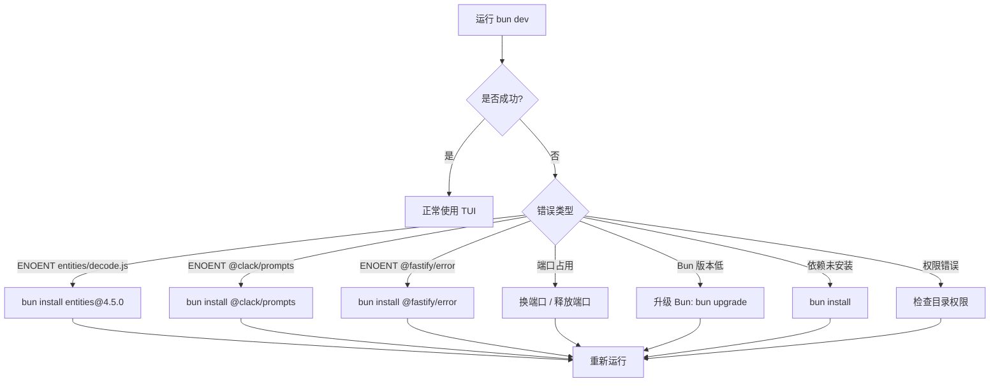

# OpenCode 项目启动操作手册

> 适用仓库：[anomalyco/opencode](https://github.com/anomalyco/opencode)
> 最后更新：2026-07-09

---

## 目录

1. [环境要求](#1-环境要求)
2. [首次启动（快速开始）](#2-首次启动快速开始)
3. [启动模式详解](#3-启动模式详解)
   - [TUI 模式](#31-tui-模式默认)
   - [API Server 模式](#32-api-server-模式)
   - [Web 模式](#33-web-模式)
   - [Desktop 模式](#34-desktop-模式)
   - [Console 模式](#35-console-模式)
   - [Mini 模式](#36-mini-模式快速调试)
4. [常用参数](#4-常用参数)
5. [环境变量](#5-环境变量)
6. [查看日志](#6-查看日志)
7. [项目结构速览](#7-项目结构速览)
8. [常见问题排查](#8-常见问题排查)
9. [本地调试](#9-本地调试)
   - [终端 + VS Code Attach](#91-方式一终端启动--vs-code-attach推荐)
   - [VS Code Launch 直接启动](#92-方式二vs-code-launch-直接启动)
   - [分开调试 Server 和 TUI](#93-方式三分开调试-server-和-tui)
   - [TUI 内置调试工具](#94-tui-内置调试工具)
   - [常用断点位置](#95-常用断点位置)

---

## 1. 环境要求

| 依赖 | 版本要求 | 检查命令 |
|------|----------|----------|
| **Bun** | `>= 1.3.0` | `bun --version` |
| **Node.js**（可选） | `>= 18` | `node --version` |
| **Git** | 任意 | `git --version` |

> 当前环境：Bun **1.3.13** ✅

---

## 2. 首次启动（快速开始）

```bash
# 1. 进入项目根目录
cd opencode

# 2. 安装依赖（约 2 分钟，安装 ~930 个包）
bun install

# 3. 启动开发服务器（TUI 模式，推荐新开一个终端窗口执行）
bun dev
```

### 完整流程图

```mermaid
flowchart TD
    A[克隆仓库] --> B[bun install]
    B --> C{"选择启动模式"}
    C --> D[TUI 模式]
    C --> E[API Server]
    C --> F[Web 模式]
    C --> G[Desktop 模式]

    D --> D1[bun dev]
    D1 --> D2[启动 TUI 终端界面]
    D2 --> D3[按 Tab 切换 Agent]
    D2 --> D4[/ 打开命令面板]

    E --> E1[bun dev serve]
    E1 --> E2[服务运行在 http://127.0.0.1:4096]

    F --> F1[bun dev web]
    F --> F2[bun run --cwd packages/app dev]
    F2 --> F3[启动前端开发服务器 localhost:5173]

    G --> G1[bun dev:desktop]
    G1 --> G2[Electron 应用窗口]
```

---

## 3. 启动模式详解

### 3.1 TUI 模式（默认）

终端界面（Terminal UI），最常用的开发模式。

```bash
# 基本启动
bun dev

# 在指定目录运行
bun dev /path/to/project

# 在 opencode 仓库自身目录运行
bun dev .

# 继续上一个会话
bun dev -c

# 指定模型
bun dev -m openai/gpt-4o-mini
```

**适用场景**：日常开发、调试 Agent 行为、代码生成

**注意**：TUI 模式需要终端 TTY 支持，在 CI/后台环境不可用。

---

### 3.2 API Server 模式

启动无头 API 服务器，适合后端集成或从外部工具调用。

```bash
# 默认端口 4096
bun dev serve

# 自定义端口
bun dev serve --port 8080

# 指定主机名
bun dev serve --hostname 0.0.0.0
```

**输出示例**：
```
Warning: OPENCODE_SERVER_PASSWORD is not set; server is unsecured.
opencode server listening on http://127.0.0.1:4096
```

> ⚠️ **安全提醒**：生产环境务必设置 `OPENCODE_SERVER_PASSWORD` 环境变量。

**适用场景**：
- 后端集成 / CI 管道
- 远程开发
- 与其他工具配合使用

#### 代码调用链

```
bun dev serve
  └─ package.json "scripts.dev"
       └─ packages/opencode/src/index.ts    ← yargs CLI 入口，注册 ServeCommand
            └─ packages/opencode/src/cli/cmd/serve.ts  ← command: "serve"
                 └─ packages/opencode/src/server/server.ts  ← Server.listen()
                      └─ HttpRouter.serve(HttpApiApp.createRoutes(opts))
                           └─ Hono HTTP 服务监听端口
```

| # | 文件 | 职责 |
|---|------|------|
| 1 | [package.json](../../package.json) | `bun dev` → `bun run --cwd packages/opencode --conditions=browser src/index.ts`，`serve` 参数传给 CLI |
| 2 | [packages/opencode/src/index.ts](packages/opencode/src/index.ts) | yargs 解析 `serve` 子命令，路由到 ServeCommand |
| 3 | [packages/opencode/src/cli/cmd/serve.ts](packages/opencode/src/cli/cmd/serve.ts) | ServeCommand handler：检查密码 → 解析网络选项 → 调用 `Server.listen()` → `yield* Effect.never` 保持进程 |
| 4 | [packages/opencode/src/server/server.ts](packages/opencode/src/server/server.ts) | `listen()` → `listenEffect()` → `listenerLayer()` → 创建 Hono 路由并监听端口 |

**serve.ts 核心代码**：

```ts
// packages/opencode/src/cli/cmd/serve.ts
handler: Effect.fn("Cli.serve")(function* (args) {
  const { Server } = yield* Effect.promise(() => import("../../server/server"))
  if (!Flag.OPENCODE_SERVER_PASSWORD) {
    console.log("Warning: OPENCODE_SERVER_PASSWORD is not set; server is unsecured.")
  }
  const opts = yield* resolveNetworkOptions(args)
  const server = yield* Effect.promise(() => Server.listen(opts))
  console.log(`opencode server listening on http://${server.hostname}:${server.port}`)
  yield* Effect.never  // 保持进程不退出
})
```

---

### 3.3 Web 模式

启动 Web UI 界面，在浏览器中使用 OpenCode。

需要**同时启动两个进程**：

```bash
# 终端 1：启动 API 服务器
bun dev serve

# 终端 2：启动 Web 前端
bun dev:web
# 等价于：bun run --cwd packages/app dev
```

Web 前端默认运行在 `http://localhost:5173`。

**适用场景**：UI 组件开发、不习惯 TUI 时使用浏览器操作

---

### 3.4 Desktop 模式

启动 Electron 桌面应用。

```bash
bun dev:desktop
```

生产构建：

```bash
bun run --cwd packages/desktop build
bun run --cwd packages/desktop package
```

**适用场景**：桌面端集成测试、原生功能开发

---

### 3.5 Console 模式

启动 Web Console 管理面板。

```bash
bun dev:console
```

**适用场景**：管理后台开发、数据统计

---

### 3.6 Mini 模式（快速调试）

精简版 TUI，启动速度更快，适合快速测试。

```bash
# 启动 mini 模式
bun dev --mini

# 直接指定 prompt，执行后自动退出
bun dev --mini --prompt "生成一个冒泡排序算法"
```

**适用场景**：快速验证流程、单次 Prompt 测试、断点调试

---

## 4. 常用参数

### 全部模式通用

| 参数 | 别名 | 类型 | 说明 | 示例 |
|------|------|------|------|------|
| `--model` | `-m` | string | 指定模型 | `-m openai/gpt-4o` |
| `--continue` | `-c` | boolean | 继续上一个会话 | `-c` |
| `--session` | `-s` | string | 指定会话 ID | `-s ses_xxx` |
| `--fork` | - | boolean | Fork 会话（需配合 -c 或 -s） | `-c --fork` |
| `--prompt` | - | string | 初始 Prompt | `--prompt "你好"` |
| `--agent` | - | string | 指定 Agent | `--agent plan` |
| `--auto` | - | boolean | 自动批准权限 | `--auto` |
| `--mini` | - | boolean | 精简模式 | `--mini` |
| `--print-logs` | - | boolean | 打印日志到 stderr | `--print-logs` |
| `--log-level` | - | string | 日志级别：DEBUG/INFO/WARN/ERROR | `--log-level DEBUG` |

### Server 模式专用

| 参数 | 类型 | 说明 | 默认值 |
|------|------|------|--------|
| `--port` | number | 监听端口 | `4096` |
| `--hostname` | string | 监听地址 | `127.0.0.1` |
| `--mdns` | boolean | 启用 mDNS | `false` |

---

## 5. 环境变量

| 变量名 | 说明 | 示例 |
|--------|------|------|
| `OPENCODE_SERVER_PASSWORD` | API 服务器密码（生产必设） | `export OPENCODE_SERVER_PASSWORD=mypass` |
| `OPENCODE_PRINT_LOGS` | 打印日志到 stderr（等效 --print-logs） | `1` |
| `OPENCODE_LOG_LEVEL` | 日志级别：DEBUG / INFO / WARN / ERROR | `DEBUG` |
| `OPENCODE_ROUTE` | 指定初始路由 | `{"type":"home"}` |
| `OPENCODE_FAST_BOOT` | 跳过启动动画 | `1` |
| `OPENCODE_DISABLE_MOUSE` | 禁用鼠标支持 | `1` |
| `OPENCODE_SHOW_TTFD` | 显示首屏渲染时间 | `1` |
| `OPENCODE_EXPERIMENTAL_DISABLE_COPY_ON_SELECT` | 禁用选择时自动复制 | `1` |
| `BUN_OPTIONS` | Bun 全局选项，如 `--inspect` | `--inspect=ws://localhost:6499/` |

**组合使用示例**：
```bash
OPENCODE_FAST_BOOT=1 \
OPENCODE_ROUTE='{"type":"home"}' \
OPENCODE_DISABLE_MOUSE=1 \
bun dev --mini
```

---

## 6. 查看日志

### 6.1 三种查看方式

#### 方式一：启动时加 `--print-logs` 参数（推荐）

```bash
# 默认 INFO 级别，打印到终端
bun dev --print-logs
bun dev serve --print-logs

# 设置 DEBUG 级别，打印更详细的日志
bun dev serve --print-logs --log-level DEBUG
```

输出示例：
```
timestamp=2026-07-09T04:34:29.685Z level=INFO run=fe475853 message=loading path="...config.json"
timestamp=2026-07-09T04:34:29.690Z level=INFO run=fe475853 message=loading path="...opencode.json"
opencode server listening on http://127.0.0.1:54998
```

每个日志条目包含：`timestamp` 时间戳、`level` 级别、`run` 运行 ID、`message` 消息内容。

#### 方式二：使用环境变量（持久生效）

```bash
# 设置后，后续所有 bun dev 都自动打印日志
export OPENCODE_PRINT_LOGS=1
export OPENCODE_LOG_LEVEL=DEBUG
bun dev serve
```

#### 方式三：查看日志文件

无论是否加 `--print-logs`，日志始终会写入文件。

**Windows 路径**：
```
%LOCALAPPDATA%\opencode\log\opencode.log
# 即：C:\Users\Administrator\AppData\Local\opencode\log\opencode.log
```

**Linux / macOS 路径**：
```
~/.local/share/opencode/log/opencode.log
```

```bash
# 实时跟踪最新日志
tail -f C:/Users/Administrator/AppData/Local/opencode/log/opencode.log

# 查看最后 100 行
tail -n 100 C:/Users/Administrator/AppData/Local/opencode/log/opencode.log

# 搜索关键词
grep ERROR C:/Users/Administrator/AppData/Local/opencode/log/opencode.log
```

### 6.2 日志级别说明

| 级别 | 启动参数 | 环境变量 | 用途 |
|------|----------|----------|------|
| `ERROR` | `--log-level ERROR` | `OPENCODE_LOG_LEVEL=ERROR` | 仅错误 |
| `WARN` | `--log-level WARN` | `OPENCODE_LOG_LEVEL=WARN` | 警告 + 错误 |
| `INFO` | （默认） | （默认） | 常规信息 |
| `DEBUG` | `--log-level DEBUG` | `OPENCODE_LOG_LEVEL=DEBUG` | 详细调试信息 |

> **默认不打印日志**：`bun dev serve` 默认只显示启动信息，不加 `--print-logs` 不会输出应用日志。

---

## 7. 项目结构速览

```
opencode/
├── package.json              # 根工程配置
├── bunfig.toml               # Bun 配置
├── README.md                 # 项目介绍
├── CONTRIBUTING.md           # 贡献指南
├── TUI_DEBUGGING_GUIDE.md    # TUI 调试指南（中文）
├── install                   # 一键安装脚本
│
├── packages/
│   ├── opencode/             # 🔥 核心包 - CLI 入口 + 业务逻辑 + TUI
│   │   ├── src/
│   │   │   ├── index.ts      # CLI 入口文件
│   │   │   ├── cli/
│   │   │   │   ├── cmd/
│   │   │   │   │   └── tui.ts    # TUI 命令处理器
│   │   │   │   └── tui/
│   │   │   │       ├── layer.ts  # TUI 运行层（注入依赖）
│   │   │   │       └── worker.ts # Worker 线程（RPC + Server）
│   │   │   ├── server/       # Hono HTTP 服务器
│   │   │   ├── session/      # 会话管理
│   │   │   └── agent/        # Agent 逻辑
│   │   └── script/
│   │       └── build.ts      # 构建脚本
│   │
│   ├── core/                 # 核心库（Effect 架构）
│   ├── app/                  # Web UI 组件（SolidJS）
│   ├── desktop/              # Electron 桌面应用
│   ├── console/app/          # Web Console 管理面板
│   ├── sdk/js/               # JavaScript SDK
│   ├── storybook/            # UI 组件库文档
│   └── stats/app/            # 统计面板
│
├── .opencode/                # OpenCode 内部配置
├── artifacts/                # 构建产物
├── infra/                    # 基础设施（SST/AWS）
└── nix/                      # Nix 包管理
```

### 核心入口文件

| 文件 | 作用 |
|------|------|
| `packages/opencode/src/index.ts` | 🚪 CLI 主入口，所有模式由此进入 |
| `packages/opencode/src/cli/cmd/tui.ts` | TUI 命令解析 + Worker 创建 |
| `packages/opencode/src/cli/tui/layer.ts` | TUI 服务依赖注入 |
| `packages/opencode/src/cli/tui/worker.ts` | Worker 线程 RPC + Server |
| `packages/app/src/` | Web UI 组件 |

---

## 8. 常见问题排查

### 8.1 `Cannot find module 'entities/lib/decode.js'`

**原因**：Windows 上 Bun 安装 `htmlparser2` 时缺少其依赖 `entities` 包。

**解决**：
```bash
bun install entities@4.5.0
```

### 8.2 `Error: ENOENT reading "...@clack/prompts"`

**原因**：`@clack/prompts` 包未正确安装。

**解决**：
```bash
bun install @clack/prompts@latest
```

### 8.3 `Error: ENOENT reading "...@fastify/error"`

**原因**：`@fastify/error` 包未正确安装（加载 DEBUG 日志级别时可能触发）。

**解决**：
```bash
bun install @fastify/error@latest
```

> Windows 上 Bun 可能存在依赖解析不完整的问题，遇到这类 `ENOENT reading` 错误时，直接 `bun install <包名>` 即可。

### 8.4 `Error: listen EADDRINUSE`

**原因**：端口被占用。

**解决**：
```bash
# 使用其他端口
bun dev serve --port 8080

# 或查找并释放端口（Windows）
netstat -ano | findstr :4096
taskkill /PID <PID> /F
```

### 8.5 TUI 启动后无显示

**原因**：通常是因为在后台运行或没有 TTY 支持。

**解决**：
```bash
# 方法一：在新终端窗口中运行
# 直接在新的命令提示符或 PowerShell 中执行：
bun dev

# 方法二：改用 API Server 模式
bun dev serve

# 方法三：使用 tmux（WSL/Linux）
tmux new-session -d -s opencode 'bun dev'
tmux attach -t opencode
```

### 8.6 依赖安装失败

```bash
# 强制重新安装
rm -rf node_modules bun.lock
bun install

# 如遇网络问题，可尝试设置镜像（Windows 在 bunfig.toml 中配置）
```

### 8.7 `OPENCODE_SERVER_PASSWORD` 未设置警告

API Server 模式下如果看到此警告，表示服务器无访问保护。

```bash
# 设置密码后重启
export OPENCODE_SERVER_PASSWORD=your-secure-password
bun dev serve
```

### 8.8 图示：启动排查决策流



---

## 9. 本地调试

### 9.1 方式一：终端启动 + VS Code Attach（推荐）

Bun 调试最稳定的方式，先以 inspect 模式在终端启动，再用 VS Code 附加调试器。这样可以避免断点映射错位问题。

```bash
# 终端中启动（以 API Server 为例）
bun run --inspect=ws://localhost:6499/ --cwd packages/opencode ./src/index.ts serve --port 4096

# 也可以简写（需要设置环境变量）
export BUN_OPTIONS="--inspect=ws://localhost:6499/"
bun dev serve
```

然后在 VS Code 中按 F5，选择 **"opencode (attach)"** 配置。

配置 `.vscode/launch.json`：

```json
{
  "version": "0.2.0",
  "configurations": [
    {
      "type": "bun",
      "request": "attach",
      "name": "opencode (attach)",
      "url": "ws://localhost:6499/"
    }
  ]
}
```

> 可用 `--inspect-wait` 替代 `--inspect`，等待调试器连接后再执行代码；或 `--inspect-brk` 在第一行中断。

### 9.2 方式二：VS Code Launch 直接启动

VS Code 中按 F5 直接启动，**可能遇到断点映射错位问题**，但仍可尝试。

```json
{
  "version": "0.2.0",
  "configurations": [
    {
      "type": "bun",
      "request": "launch",
      "name": "TUI Debug (Mini)",
      "cwd": "${workspaceFolder}/packages/opencode",
      "program": "./src/index.ts",
      "args": ["--mini", "--prompt", "hello"],
      "env": {
        "OPENCODE_FAST_BOOT": "1"
      },
      "console": "integratedTerminal"
    },
    {
      "type": "bun",
      "request": "launch",
      "name": "TUI Debug (Full)",
      "cwd": "${workspaceFolder}/packages/opencode",
      "program": "./src/index.ts",
      "console": "externalTerminal"
    },
    {
      "type": "bun",
      "request": "launch",
      "name": "API Server Debug",
      "cwd": "${workspaceFolder}/packages/opencode",
      "program": "./src/index.ts",
      "args": ["serve", "--port", "4096"]
    }
  ]
}
```

> 需要安装 [Bun VS Code 扩展](https://marketplace.visualstudio.com/items?itemName=oven.bun-vscode)（项目 `.vscode/settings.example.json` 中有推荐）。

### 9.3 方式三：分别调试 Server 和 TUI

TUI 模式下，服务器在 Worker 线程中运行，断点可能不触发。此时可将二者分开调试：

```bash
# 终端 1：单独调试 Server
bun run --inspect=ws://localhost:6499/ --cwd packages/opencode ./src/index.ts serve --port 4096

# 终端 2：用 attach 模式连接现有 Server
opencode attach http://localhost:4096

# 或终端 2：单独调试 TUI（不启动内置 Server）
bun run --inspect=ws://localhost:6499/ --cwd packages/opencode --conditions=browser ./src/index.ts
```

### 9.4 TUI 内置调试工具

在 TUI 界面中按 `/` 打开命令面板：

| 命令 | 快捷键 | 说明 |
|------|--------|------|
| `app.debug` | - | 切换调试面板 |
| `app.console` | - | 打开 OpenTUI 控制台 |
| `app.heap_snapshot` | - | 写入堆快照 |
| `opencode.debug` | `/debug` | 显示调试信息对话框 |
| `opencode.status` | `/status` | 显示系统状态对话框 |

**堆快照分析**：输入 `app.heap_snapshot` 后，快照写入当前目录（`tui.heapsnapshot` / `server.heapsnapshot`），可在 Chrome DevTools → Memory → Load 中分析。

### 9.5 常用断点位置

| 文件 | 说明 |
|------|------|
| `packages/opencode/src/cli/cmd/tui.ts` | TUI 命令解析与 Worker 创建入口 |
| `packages/opencode/src/cli/tui/layer.ts` | TUI 运行层，服务依赖注入 |
| `packages/opencode/src/cli/tui/worker.ts` | Worker 线程 RPC + Server |
| `packages/opencode/src/server/server.ts` | HTTP 服务器（Hono） |
| `packages/opencode/src/session/` | 会话处理核心逻辑 |
| `packages/opencode/src/agent/` | Agent 逻辑 |
| `packages/tui/src/app.tsx` | TUI 应用入口（SolidJS） |
| `packages/tui/src/routes/session.tsx` | 会话页面渲染 |
| `packages/sdk/js/src/v2/client.ts` | SDK 客户端请求 |

---

## 附录：命令速查表

| 命令 | 说明 | 常用度 |
|------|------|--------|
| `bun install` | 安装依赖 | ⭐⭐⭐ |
| `bun dev` | TUI 模式 | ⭐⭐⭐ |
| `bun dev serve` | API Server 模式 | ⭐⭐⭐ |
| `bun dev web` | 启动 Web UI 前端 | ⭐⭐ |
| `bun dev:web` | 同上（别名） | ⭐⭐ |
| `bun dev:desktop` | Desktop 模式 | ⭐ |
| `bun dev --mini` | Mini 精简模式 | ⭐⭐ |
| `bun dev --mini --prompt "xxx"` | Mini + 自动 Prompt | ⭐⭐ |
| `bun dev -c` | 继续上一会话 | ⭐⭐ |
| `bun dev -m provider/model` | 指定模型启动 | ⭐⭐ |
| `bun run typecheck` | 类型检查 | ⭐ |
| `bun run lint` | 代码检查（oxlint） | ⭐ |
| `bun run --cwd packages/opencode script/build.ts --single` | 编译独立可执行文件 | ⭐ |

---

> **相关文档**：
> - [CONTRIBUTING.md](./CONTRIBUTING.md) — 贡献指南与详细开发说明
> - [TUI_DEBUGGING_GUIDE.md](./TUI_DEBUGGING_GUIDE.md) — TUI 调试与架构详解
> - [AGENTS.md](./AGENTS.md) — Agent 系统说明
> - [CONTEXT.md](./CONTEXT.md) — 项目上下文
> - 官方文档：[opencode.ai/docs](https://opencode.ai/docs)
